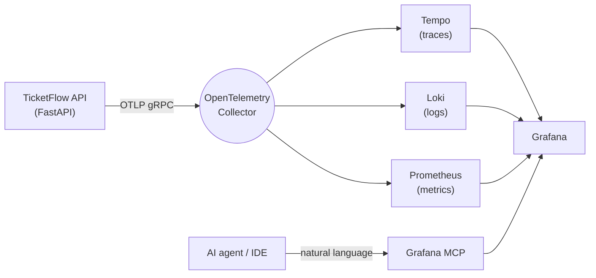

# ticketflow-observability

[Português](README.md) · [**English**](README.en.md)

[](LICENSE)
[](https://www.python.org/)
[](https://fastapi.tiangolo.com/)
[](https://opentelemetry.io/)
[](https://grafana.com/)

> A hands-on example of **modern observability meeting AI**: a ticket-selling API instrumented end to end with OpenTelemetry, a full observability stack (Prometheus, Tempo, Loki, Grafana), and the **Grafana MCP** so you can investigate telemetry in plain language.

A small **ticket-selling API** (Python + FastAPI + PostgreSQL) emits traces, metrics, and logs through OpenTelemetry. On top of the stack, the Grafana MCP lets an AI agent — right in your IDE — query metrics, logs, traces, and alerts conversationally, and diagnose a simulated production incident without you writing a single query.



The application sends telemetry only to the **OpenTelemetry Collector** via OTLP. The collector fans it out to Tempo (traces), Loki (logs), and Prometheus (metrics), and **Grafana** unifies the visualization. The **Blackbox Exporter** performs external health checks.

> A study project based on the observability material from a graduate program in Applied AI Engineering, adapted to a ticket-selling scenario and rewritten in Python/FastAPI.

---

## In one sentence

Bring the stack up with one command, trigger an intentional incident (connection pool exhaustion), and ask the AI to find the root cause by correlating metrics, logs, and traces — all local, all reproducible.

---

## Components

| Service | Role | URL |
|---|---|---|
| TicketFlow API | Demo application (FastAPI) | http://localhost:9000 |
| Grafana | Dashboards and exploration | http://localhost:3000 |
| Prometheus | Metrics and alerts | http://localhost:9090 |
| Tempo | Distributed traces | http://localhost:3200 |
| Loki | Log aggregation | http://localhost:3100 |
| OpenTelemetry Collector | Telemetry hub (own metrics at `/metrics`) | http://localhost:8889/metrics |
| Blackbox Exporter | External health checks | http://localhost:9115 |
| Grafana MCP | MCP server for AI agents | http://localhost:8000/mcp |
| PostgreSQL | Database | localhost:5433 |

---

## Running it

Prerequisites: **Docker** and **Docker Compose**.

```bash
# Bring up the whole stack (infrastructure + application)
docker compose up --build

# Check service status
docker compose ps
```

Open **Grafana** at http://localhost:3000 (anonymous Admin login is enabled). The **TicketFlow — Application Metrics** dashboard is provisioned out of the box.

### Testing the API

```bash
# List available events
curl http://localhost:9000/events

# Buy 2 tickets for event 1
curl -X POST http://localhost:9000/events/1/buy \
  -H 'Content-Type: application/json' \
  -d '{"buyer":"ana@example.com","quantity":2}'
```

### Generating load

```bash
./scripts/generate-load.sh
```

---

## Observability with AI (Grafana MCP)

Once the stack is up, the **Grafana MCP** server runs at `http://localhost:8000/mcp`. Connect it to your AI-enabled IDE. Example configuration (Cursor / Windsurf):

```json
{
  "mcpServers": {
    "grafana": {
      "type": "sse",
      "url": "http://localhost:8000/mcp"
    }
  }
}
```

Then just ask in natural language. See [`docs/grafana-mcp-prompts.md`](docs/grafana-mcp-prompts.md) for ready-to-use prompts.

---

## Failure scenario: connection leak

The project ships one simple, realistic failure scenario to exercise AI-assisted diagnosis. When `SCENARIO_LEAKY_CONNECTIONS=true`, every ticket purchase leaks a database connection from the pool. Because the pool is small (`max_size=5`), it exhausts quickly and requests start failing with timeouts (5xx errors and high latency).

```bash
# Bring up the stack with the failure scenario enabled
SCENARIO_LEAKY_CONNECTIONS=true docker compose up --build

# In another terminal, generate load
./scripts/generate-load.sh
```

Then ask the AI (through the Grafana MCP):

> The ticketflow application started returning 5xx errors and latency went up. Correlate metrics, logs, and traces from the last 15 minutes and tell me the root cause.

The AI is expected to correlate the spike in errors and latency on the purchase endpoint with the connection-leak logs and conclude that the database pool is exhausted.

---

## Layout

```
ticketflow-observability/
├── docker-compose.yaml          # Full stack (infra + app)
├── LICENSE                      # MIT
├── app/                         # FastAPI application
│   ├── main.py                  # Endpoints, metrics, and failure scenario
│   ├── otel.py                  # OpenTelemetry setup
│   ├── db.py                    # Connection pool, schema, and seed
│   ├── config.py                # Environment-based configuration
│   └── Dockerfile
├── infra/                       # Observability stack
│   ├── docker-compose-infra.yaml
│   ├── otel-collector/
│   ├── prometheus/
│   ├── tempo/
│   ├── loki/
│   ├── blackbox/
│   └── grafana/
├── scripts/
│   └── generate-load.sh         # Load generator
└── docs/
    └── grafana-mcp-prompts.md   # Example prompts for the AI
```

---

## Stopping

```bash
docker compose down          # Stop services
docker compose down -v       # Stop and remove volumes
```

---

## License

Released under the [MIT](LICENSE) license.

## Credits

Based on the fundamentals module of a graduate program in Applied AI Engineering, adapted for study purposes (new domain and stack rewritten in Python/FastAPI).
