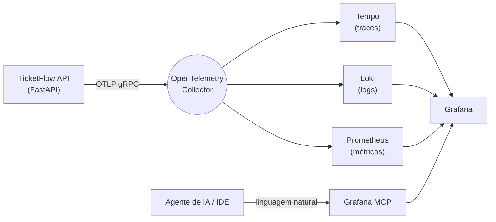

# ticketflow-observability

[**Português**](README.md) · [English](README.en.md)

[](LICENSE)
[](https://www.python.org/)
[](https://fastapi.tiangolo.com/)
[](https://opentelemetry.io/)
[](https://grafana.com/)

> Exemplo didático de **observabilidade moderna integrada a IA**: uma API de venda de ingressos instrumentada de ponta a ponta com OpenTelemetry, uma stack completa de observabilidade (Prometheus, Tempo, Loki, Grafana) e o **Grafana MCP** para investigar a telemetria em linguagem natural.

Uma pequena API de **venda de ingressos** (Python + FastAPI + PostgreSQL) emite traces, métricas e logs via OpenTelemetry. Por cima da stack, o Grafana MCP permite que um agente de IA — na sua IDE — consulte métricas, logs, traces e alertas conversando, e diagnostique um incidente de produção simulado sem que você escreva uma única query.



A aplicação envia telemetria apenas para o **OpenTelemetry Collector** via OTLP. O collector distribui para Tempo (traces), Loki (logs) e Prometheus (métricas), e o **Grafana** unifica a visualização. O **Blackbox Exporter** faz health checks externos dos serviços.

> Projeto de estudo baseado no material de observabilidade da pós de Engenharia de IA Aplicada, adaptado para o cenário de venda de ingressos e reescrito em Python/FastAPI.

---

## Em uma frase

Suba a stack com um comando, gere um incidente proposital (esgotamento do pool de conexões) e peça para a IA achar a causa raiz correlacionando métricas, logs e traces — tudo local, tudo reproduzível.

---

## Componentes

| Serviço | Papel | URL |
|---|---|---|
| TicketFlow API | Aplicação demo (FastAPI) | http://localhost:9000 |
| Grafana | Dashboards e exploração | http://localhost:3000 |
| Prometheus | Métricas e alertas | http://localhost:9090 |
| Tempo | Traces distribuídos | http://localhost:3200 |
| Loki | Agregação de logs | http://localhost:3100 |
| OpenTelemetry Collector | Hub de telemetria (métricas próprias em `/metrics`) | http://localhost:8889/metrics |
| Blackbox Exporter | Health checks externos | http://localhost:9115 |
| Grafana MCP | Servidor MCP para agentes de IA | http://localhost:8000/mcp |
| PostgreSQL | Banco de dados | localhost:5433 |

---

## Como rodar

Pré-requisitos: **Docker** e **Docker Compose**.

```bash
# Sobe toda a stack (infraestrutura + aplicação)
docker compose up --build

# Verifica o status dos serviços
docker compose ps
```

Acesse o **Grafana** em http://localhost:3000 (login anônimo como Admin já habilitado). O dashboard **TicketFlow — Application Metrics** já vem provisionado.

### Testando a API

```bash
# Lista os eventos disponíveis
curl http://localhost:9000/events

# Compra 2 ingressos para o evento 1
curl -X POST http://localhost:9000/events/1/buy \
  -H 'Content-Type: application/json' \
  -d '{"buyer":"ana@example.com","quantity":2}'
```

### Gerando carga

```bash
./scripts/generate-load.sh
```

---

## Observabilidade com IA (Grafana MCP)

Com a stack no ar, o servidor **Grafana MCP** roda em `http://localhost:8000/mcp`. Conecte-o à sua IDE com IA. Exemplo de configuração (Cursor / Windsurf):

```json
{
  "mcpServers": {
    "grafana": {
      "type": "sse",
      "url": "http://localhost:8000/mcp"
    }
  }
}
```

Depois é só perguntar em linguagem natural. Veja [`docs/grafana-mcp-prompts.md`](docs/grafana-mcp-prompts.md) para exemplos prontos.

---

## Cenário de falha: vazamento de conexões

O projeto inclui um cenário de falha realista e simples para exercitar o diagnóstico com IA. Quando `SCENARIO_LEAKY_CONNECTIONS=true`, cada compra de ingresso vaza uma conexão do pool do banco. Como o pool é pequeno (`max_size=5`), ele se esgota rapidamente e as requisições passam a falhar com timeout (erros 5xx e latência alta).

```bash
# Sobe a stack com o cenário de falha ativado
SCENARIO_LEAKY_CONNECTIONS=true docker compose up --build

# Em outro terminal, gera carga
./scripts/generate-load.sh
```

Depois, peça à IA (via Grafana MCP):

> A aplicação ticketflow começou a retornar erros 5xx e a latência subiu. Correlacione métricas, logs e traces dos últimos 15 minutos e diga qual é a causa raiz.

O esperado é que a IA correlacione o pico de erros e latência no endpoint de compra com os logs de vazamento de conexão e conclua que o pool do banco está esgotado.

---

## Estrutura

```
ticketflow-observability/
├── docker-compose.yaml          # Stack completa (infra + app)
├── LICENSE                      # MIT
├── app/                         # Aplicação FastAPI
│   ├── main.py                  # Endpoints, métricas e cenário de falha
│   ├── otel.py                  # Setup do OpenTelemetry
│   ├── db.py                    # Pool de conexões, schema e seed
│   ├── config.py                # Configuração via variáveis de ambiente
│   └── Dockerfile
├── infra/                       # Stack de observabilidade
│   ├── docker-compose-infra.yaml
│   ├── otel-collector/
│   ├── prometheus/
│   ├── tempo/
│   ├── loki/
│   ├── blackbox/
│   └── grafana/
├── scripts/
│   └── generate-load.sh         # Gerador de carga
└── docs/
    └── grafana-mcp-prompts.md   # Prompts de exemplo para a IA
```

---

## Parando

```bash
docker compose down          # Para os serviços
docker compose down -v       # Para e remove os volumes
```

---

## Licença

Distribuído sob a licença [MIT](LICENSE).

## Créditos

Baseado no material do módulo de fundamentos da pós de Engenharia de IA Aplicada, adaptado para fins de estudo (novo domínio e stack reescrita em Python/FastAPI).
